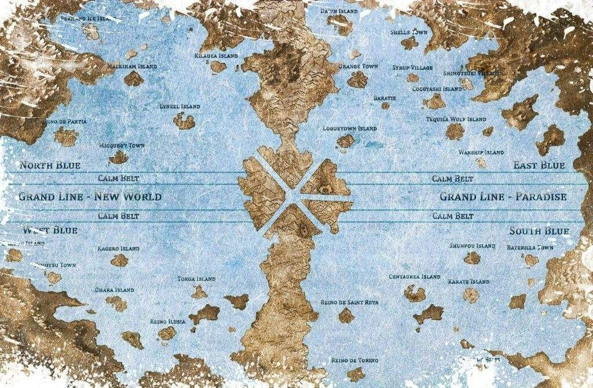
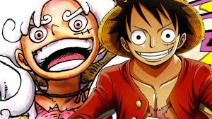
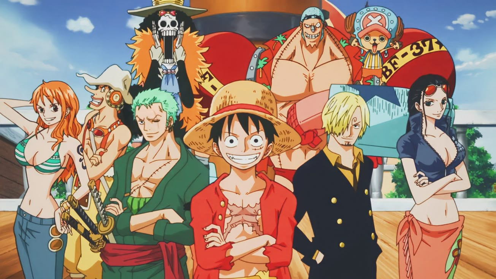

# one piece

---

## Menu

- [Accueil](index.html)
- [Histoire](Histoire.html)
- [Les personages](Les_personage.html)
- [Les arcs](Les_arcs.html)
- [Source](sources.html)

---

## Sommaire

- [L’âge d’or de la piraterie](#lhistoire-de-one-piece)
- [Carte de Grand Line](#carte-de-grand-line)
- [La chasse au One Piece](#la-chasse-au-one-piece)
- [Luffy Carte](#luffy-carte)
- [L'équipage](#léquipage)
- [Carte De L'équipe](#carte-de-léquipe)
- [Les pirates rivaux](#les-pirates-rivaux)
- [Les batailles](#les-batailles)
- [La chanson la plus célèbre](#la-chanson-la-plus-célèbre)

---

## L’histoire de One Piece

Dans un monde dominé par les océans, une époque appelée « l’âge d’or de la piraterie » s’est ouverte après l’exécution du légendaire roi des pirates, Gol D. Roger.  
Avant de mourir, Roger a révélé l’existence d’un trésor immense, le « One Piece », caché sur la dernière île de la Grand Line, appelée Laugh Tale.  
Ce trésor promet à celui qui le trouvera la gloire ultime : devenir le Roi des Pirates.

---

## Carte de Grand Line

---

## La chasse au One Piece

Vingt-deux ans plus tard, la chasse au One Piece passionne encore les pirates, bien que beaucoup doutent de son existence.  
Parmi eux, un jeune garçon nommé Monkey D. Luffy rêve de marcher sur les traces de Roger.  
Malgré les dangers, il décide de partir à l’aventure pour trouver ce trésor et devenir le Roi des Pirates.

---

## Luffy Carte

---

## L'équipage

Luffy commence son périple seul, mais très vite il rencontre et rassemble un équipage fidèle et talentueux :  
Zoro, un épéiste déterminé à devenir le meilleur du monde ;  
Nami, une navigatrice experte ;  
Usopp, un tireur d’élite courageux ;  
Sanji, un cuisinier au grand cœur ;  
Chopper, un médecin renne ;  
Robin, une historienne mystérieuse ;  
Franky, un ingénieur cyborg ;  
Brook, un musicien squelette, et Jinbe, un ancien pirate homme-poisson.

---

## Carte De L'équipe

---

## Les pirates rivaux

Ensemble, ils traversent mers et îles, affrontent des pirates rivaux, des marines puissants et des créatures fantastiques.  
Chaque île apporte son lot d’épreuves, de rencontres et de mystères.  
Luffy et son équipage défendent les opprimés, combattent l’injustice et forgent des alliances avec d’autres personnages tout aussi passionnés par la liberté.

---

Au fil des aventures, Luffy grandit en force et en sagesse, conscient que le chemin vers le titre de Roi des Pirates est semé d’embûches et de puissants ennemis.  
Son équipage devient une véritable famille, unie par la confiance et la volonté de réaliser leurs rêves.

---

## Les batailles

L’histoire suit donc ce voyage épique, où chaque bataille, chaque découverte et chaque amitié rapprochent Luffy de son but ultime, tout en dévoilant peu à peu les secrets du monde et du fameux « siècle oublié » qui entoure le mystère du One Piece.

---

## La chanson la plus célèbre

<video width="100%" height="360" controls>
  <source src="../Images/la-chansan.mp4" type="video/mp4" />
  Votre navigateur ne supporte pas l'affichage de cette vidéo.
</video>

---

## Navigation

- [Page précédente](index.html)
- [Page suivante](Les_personage.html)

---

**GHEZZAR TALHA**  
**SLAMANI ALI**
