# one piece

---

## Menu

- [Accueil](index.html)
- [Histoire](Histoire.html)
- [Les personages](Les_personage.html)
- [Les arcs](Les_arcs.html)
- [Source](sources.html)

---

## Sommaire

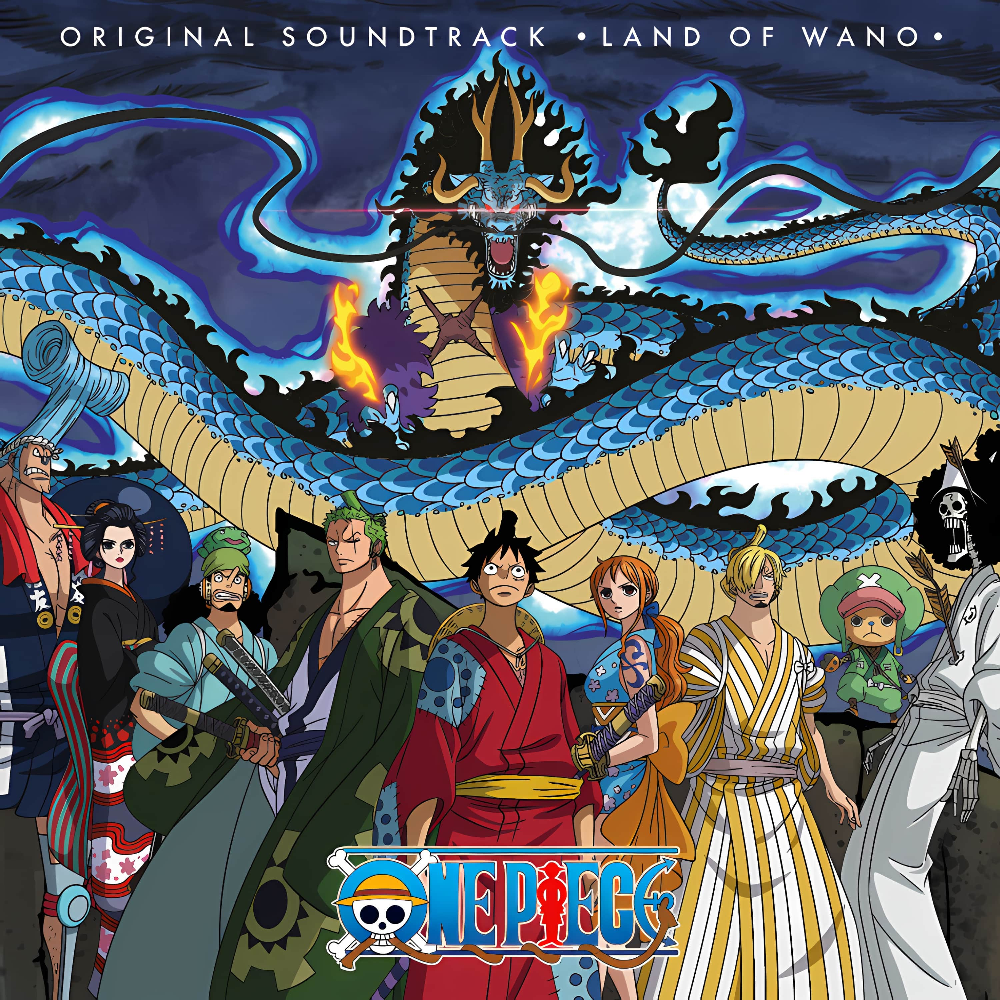

- [Saga East Blue](#saga-east-blue)
- [Saga Alabasta](#saga-alabasta)
- [Saga Skypiea](#saga-skypiea)
- [Saga Watter 7](#saga-watter-7)
- [Thriller Bark](#thriller-bark)
- [Saga Guerre au Sommet](#saga-guerre-au-sommet)
- [Saga Île des Hommes-Poissons](#saga-île-des-hommes-poissons)
- [Saga Dressrosa](#saga-dressrosa)
- [Saga Whole Cake Island](#saga-whole-cake-island)
- [Saga Finale](#saga-finale)

---

## Saga East Blue

| | | | |
|---|---|---|---|
| 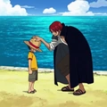 Arc Saboady (Chapitre 490 à 513) (Tome 50 à 53) (Épisode 385 à 405) | 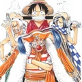 Arc Amazon Lily (Chapitre 514 à 524) (Tome 53 à 54) (Épisode 408 à 417) | 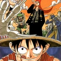 (Couvertures des Chapitre 543 à 560) (Tome 56 à 57) (Épisode 418 à 421 et 453 à 456) | 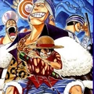 (Couvertures des Chapitre 543 à 560) (Tome 56 à 57) (Épisode 418 à 421 et 453 à 456) |
| 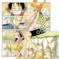 Arc Little East Blue (Arc Hors-Série) (Épisode 426 à 429) | 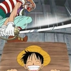 Arc Marineford (Chapitre 550 à 580) (Tome 56 à 59) (Épisode 457 à 489) | 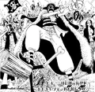 Arc Post-Marineford (Chapitre 581 à 597) (Tome 59 à 61) (Épisode 490 à 491 et 493 à 516) |  Arc Post-Marineford (Chapitre 581 à 597) (Tome 59 à 61) (Épisode 490 à 491 et 493 à 516) |

## Saga Alabasta

| | | | |
|---|---|---|---|
| 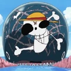 Arc Retour à Saboady (Chapitre 598 à 602) (Tome 61) (Épisode 517 à 522) | 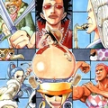 (Chapitre 603 à 653) (Tome 61 à 66) (Épisode 523 à 541 et 542 à 574) | 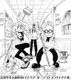 Arc Retour à Saboady (Chapitre 598 à 602) (Tome 61) (Épisode 517 à 522) | 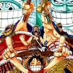 (Chapitre 603 à 653) (Tome 61 à 66) (Épisode 523 à 541 et 542 à 574) |
| 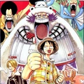 Arc Retour à Saboady (Chapitre 598 à 602) (Tome 61) (Épisode 517 à 522) | 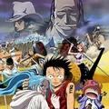 (Chapitre 603 à 653) (Tome 61 à 66) (Épisode 523 à 541 et 542 à 574) |  Arc Retour à Saboady (Chapitre 598 à 602) (Tome 61) (Épisode 517 à 522) | 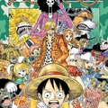 Arc Retour à Saboady (Chapitre 598 à 602) (Tome 61) (Épisode 517 à 522) |

## Saga Skypiea

| | | | |
|---|---|---|---|
|  Arc L'Ambition de Z (Arc Hors-Série) (Épisode 575 à 578) | 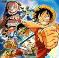 (Chapitre 654 à 699) (Tome 66 à 70) (Épisode 579 à 589 et 591 à 625) | 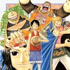 Arc Récupération de César (Arc Hors-Série) (Épisode 626 à 628) | 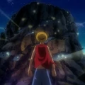 Arc Punk Hazard (Chapitre 654 à 699) (Tome 66 à 70) (Épisode 579 à 589 et 591 à 625) |

## Saga Watter 7

| | | | |
|---|---|---|---|
| 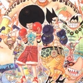 Arc L'Ambition de Z (Arc Hors-Série) (Épisode 575 à 578) | 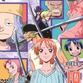 (Chapitre 654 à 699) (Tome 66 à 70) (Épisode 579 à 589 et 591 à 625) | 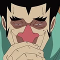 Arc Récupération de César (Arc Hors-Série) (Épisode 626 à 628) | 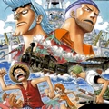 (Chapitre 654 à 699) (Tome 66 à 70) (Épisode 579 à 589 et 591 à 625) |
| 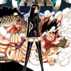 Arc L'Ambition de Z (Arc Hors-Série) (Épisode 575 à 578) |  (Chapitre 654 à 699) (Tome 66 à 70) (Épisode 579 à 589 et 591 à 625) | 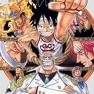 Arc Récupération de César (Arc Hors-Série) (Épisode 626 à 628) | 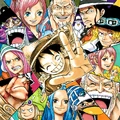 Arc Récupération de César (Arc Hors-Série) (Épisode 626 à 628) |

## Thriller Bark

| | | | |
|---|---|---|---|
| 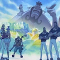 Arc L'Ambition de Z (Arc Hors-Série) (Épisode 575 à 578) |  (Chapitre 654 à 699) (Tome 66 à 70) (Épisode 579 à 589 et 591 à 625) | 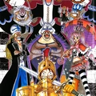 Arc Récupération de César (Arc Hors-Série) (Épisode 626 à 628) | 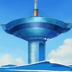 (Chapitre 654 à 699) (Tome 66 à 70) (Épisode 579 à 589 et 591 à 625) |

## Saga Guerre au Sommet

| | | | |
|---|---|---|---|
|  Arc L'Ambition de Z (Arc Hors-Série) (Épisode 575 à 578) | 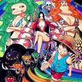 (Chapitre 654 à 699) (Tome 66 à 70) (Épisode 579 à 589 et 591 à 625) | 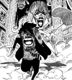 Arc Récupération de César (Arc Hors-Série) (Épisode 626 à 628) | 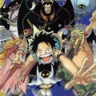 (Chapitre 654 à 699) (Tome 66 à 70) (Épisode 579 à 589 et 591 à 625) |

## Saga Île des Hommes-Poissons 

| | | | |
|---|---|---|---|
|  Arc L'Ambition de Z (Arc Hors-Série) (Épisode 575 à 578) |  (Chapitre 654 à 699) (Tome 66 à 70) (Épisode 579 à 589 et 591 à 625) |  Arc Récupération de César (Arc Hors-Série) (Épisode 626 à 628) |  (Chapitre 654 à 699) (Tome 66 à 70) (Épisode 579 à 589 et 591 à 625) |

## Saga Dressrosa

| | | | |
|---|---|---|---|
|  Arc L'Ambition de Z (Arc Hors-Série) (Épisode 575 à 578) |  (Chapitre 654 à 699) (Tome 66 à 70) (Épisode 579 à 589 et 591 à 625) |  Arc Récupération de César (Arc Hors-Série) (Épisode 626 à 628) |  (Chapitre 654 à 699) (Tome 66 à 70) (Épisode 579 à 589 et 591 à 625) |

## Saga fINAL

| | | | |
|---|---|---|---|
|  Arc Retour à Saboady (Chapitre 598 à 602) (Tome 61) (Épisode 517 à 522) |  (Chapitre 603 à 653) (Tome 61 à 66) (Épisode 523 à 541 et 542 à 574) |  Arc Retour à Saboady (Chapitre 598 à 602) (Tome 61) (Épisode 517 à 522) |  (Chapitre 603 à 653) (Tome 61 à 66) (Épisode 523 à 541 et 542 à 574) |
|  Arc Retour à Saboady (Chapitre 598 à 602) (Tome 61) (Épisode 517 à 522) |  (Chapitre 603 à 653) (Tome 61 à 66) (Épisode 523 à 541 et 542 à 574) |  Arc Retour à Saboady (Chapitre 598 à 602) (Tome 61) (Épisode 517 à 522) |  Arc Retour à Saboady (Chapitre 598 à 602) (Tome 61) (Épisode 517 à 522) |

---

**GHEZZAR TALHA**  
**SLAMANI ALI**
