# one piece

---

## Menu

- [Accueil](index.html)
- [Histoire](Histoire.html)
- [Les personages](Les_personage.html)
- [Les arcs](Les_arcs.html)
- [Source](sources.html)

---

## Sommaire

- [L'équipage du chapeau de paille](#léquipage-du-chapeau-de-paille)
- [Les anciens Yonko](#les-anciens-yonko)
- [Les Yonkos actuels](#les-yonkos-actuels)
- [La Marine](#la-marine)
- [L'équipage du Roi](#léquipage-du-roi)

---

## L'équipage du chapeau de paille

L'équipage :

| Portrait | Nom | Chapitre | Épisode | Année | Role dans l'équipage |
|----------|-----|----------|---------|-------|----------------------|
|  | Luffy | 1 | 1 | 1999 | Capitan |
|  | Zoro | 1 | 3 | 1999 | Épéiste |
|  | Usoppe | 1 | 17 | 1999 | Tireure d'élite |
|  | Sunji | 1 | 30 | 2000 | cuisinier |
|  | Nami | 1 | 44 | 2000 | Navigatrice |
|  | chuper | 1 | 91 | 2001 | médecin |
|  | Rubin | 2 | 130 | 2002 | Archéologue |
|  | Franky | 4 | 322 | 2007 | Charpentier |
|  | Brouke | 5 | 381 | 2008 | musicien |
|  | Jimbi | 8 | 876 | 2019 | Timonie principal |

---

## Les anciens Yonko

| Portrait | Nom | Chapitre | Épisode | Année | Nom de l'équipage |
|----------|-----|----------|---------|-------|-------------------|
| 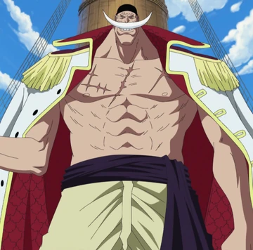 | Edward newgate | 6 | 480 | 2010 | Barbe Blanche |
| 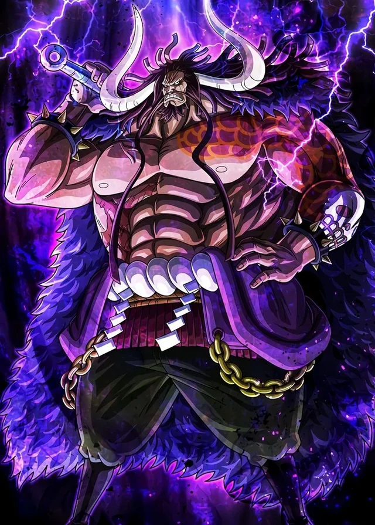 | kaido | 6 | 489 | 2010 | Kaido des cent Betes |
| 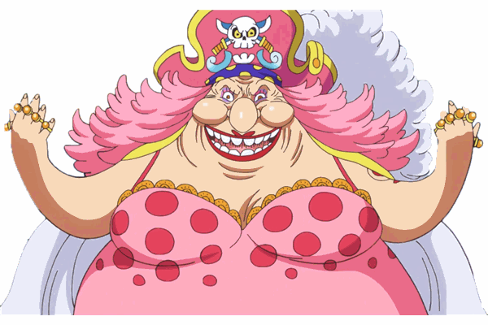 | Big Mom | 6 | 489 | 2010 | Impératrice de totto Land |
| 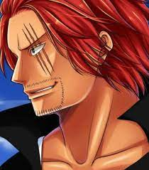 | Chanks | 1 | 1 | 1999 | Le Roux |

---

## Les Yonkos actuels

| Portrait | Nom | Chapitre | Épisode | Année | Nom de l'équipage |
|----------|-----|----------|---------|-------|-------------------|
| 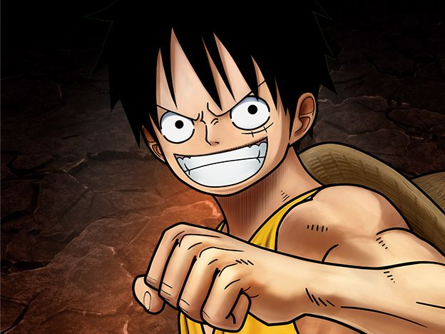 | Luffy | 1 | 1 | 1999 | Capitan |
| 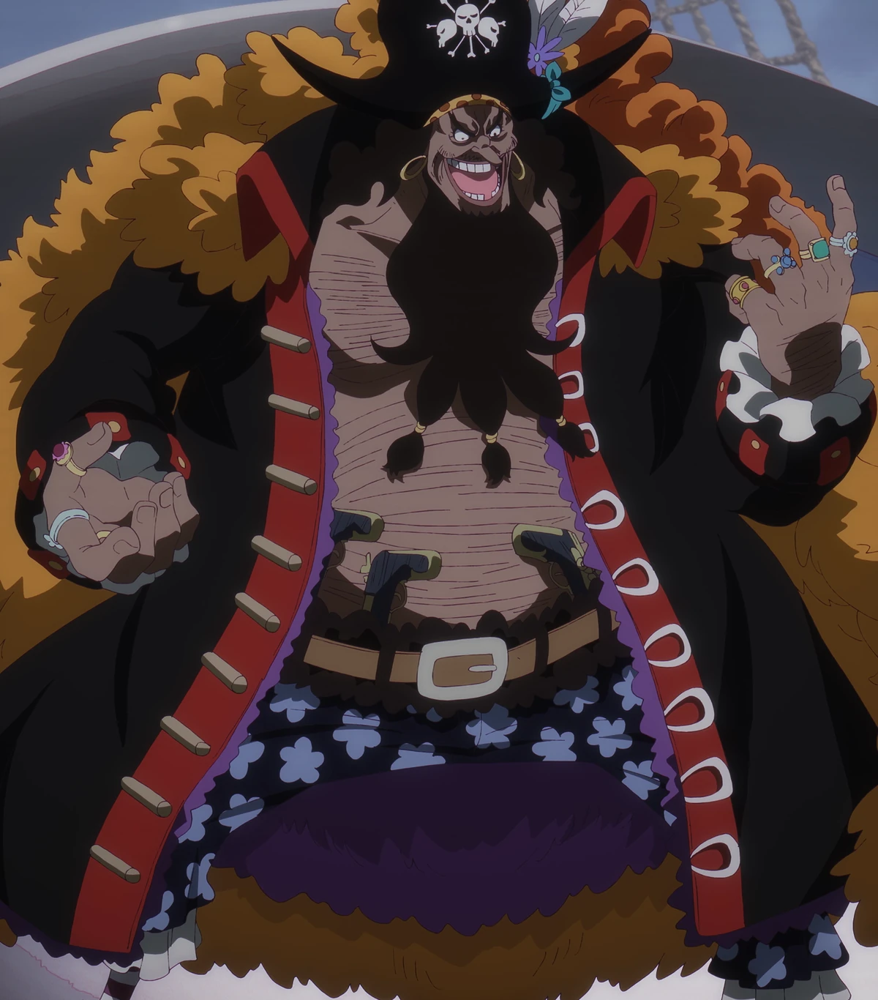 | Teach | 2 | 228 | 2003 | Barbe Noir |
| 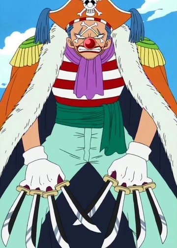 | Baggy | 1 | 10 | 1999 | Le clown |
|  | Chanks | 1 | 1 | 1999 | Le Roux |

---

## La Marine

| Portrait | Nom | Chapitre | Épisode | Année | Nom de l'équipage |
|----------|-----|----------|---------|-------|-------------------|
|  | garp | 1 | 3 | 1999 | Vice Amiral |
|  | Sengoku | 2 | 38 | 2001 | Amiral |
| 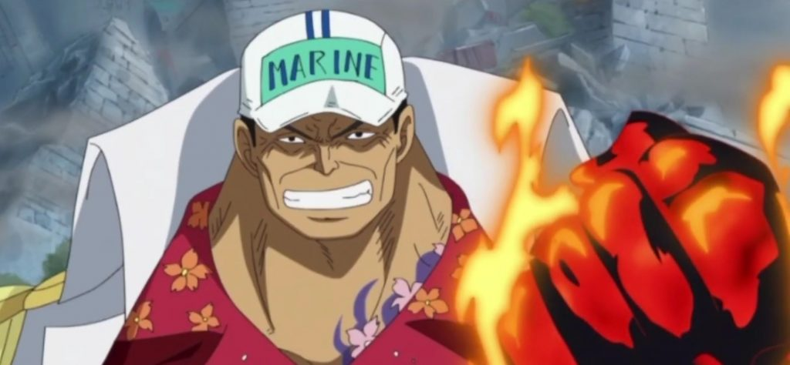 | Akainu | 1 | 39 | 2001 | Ameral |
| 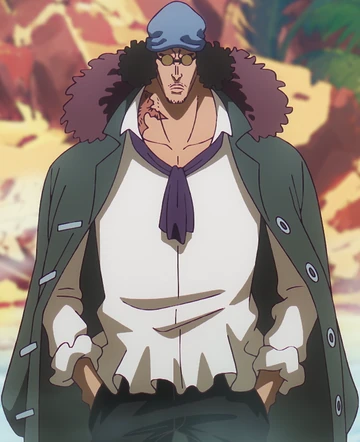 | Aokiji | 1 | 39 | 2001 | Ancien Amiral |
| 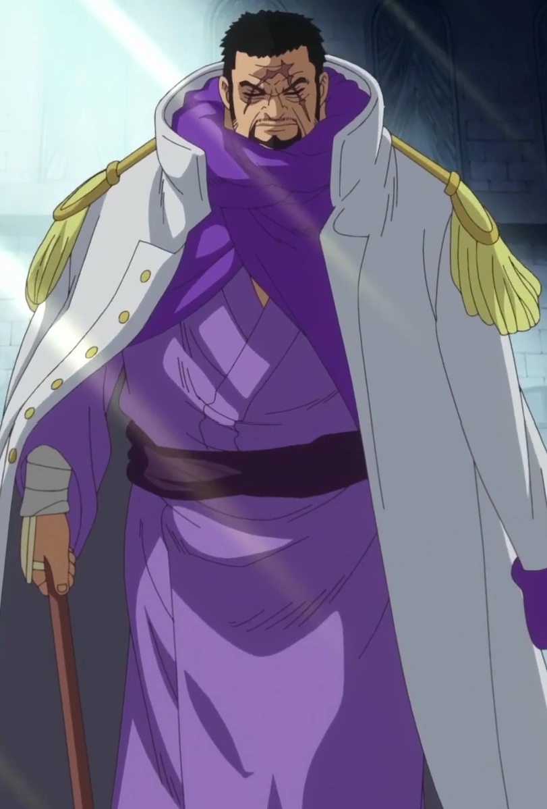 | Fujitore | 3 | 250 | 2006 | Amiral |
| 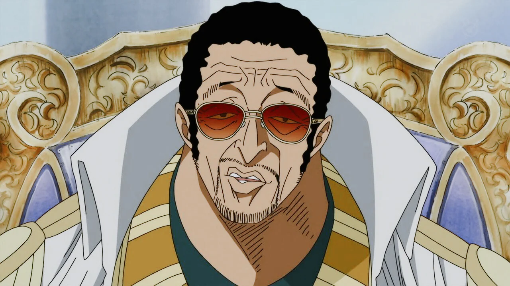 | kizaro | 4 | 461 | 2010 | Amiral |
| 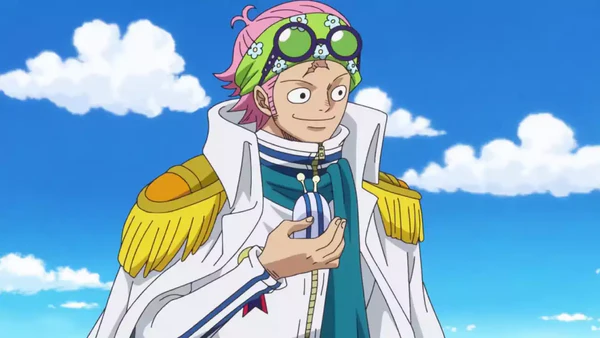 | Koby | 1 | 1 | 1999 | Capitaine |
| 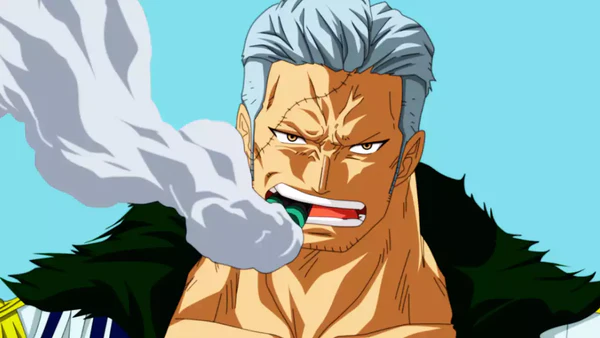 | Smoker | 1 | 10 | 1999 | Vice Amiral |

---

## L'équipage du Roi

| Portrait | Nom | Chapitre | Épisode | Année | Role dans l'équipage |
|----------|-----|----------|---------|-------|----------------------|
| 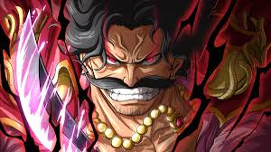 | Rojer | 1 | 50 | 2000 | Capitaine |
| 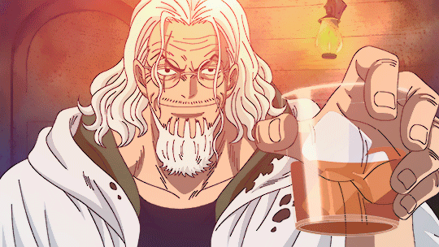 | Rayli | 3 | 256 | 2004 | Le brat droit |
|  | Scopper-gabban | 3 | 257 | 2004 | Le brat gauche |
| 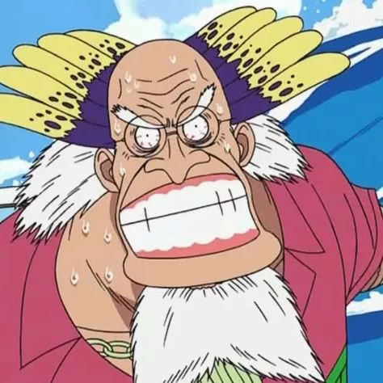 | Crocus | 3 | 256 | 2004 | médecin |
| 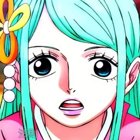 | Toki | 4 | 526 | 2013 | L'épouse |
| 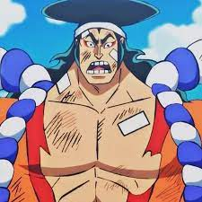 | Odden | 4 | 526 | 2013 | Archéologue |

---

## Navigation

- [Page précédente](Histoire.html)
- [Page suivante](Les_arcs.html)

---

**GHEZZAR TALHA**  
**SLAMANI ALI**
